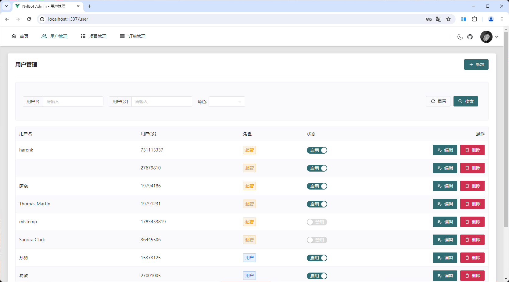
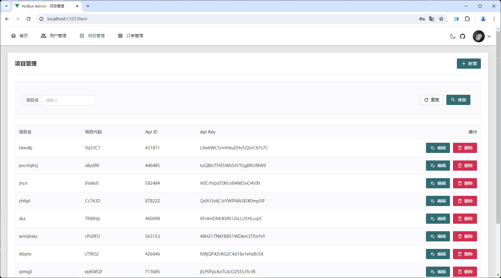
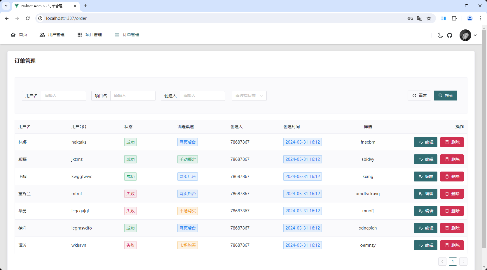

## 项目介绍

一个通过 QQ 机器人实现 Neverlose 市场物品推送绑定的项目，自带后台管理页面。

后端 Spring Boot3 + Sqlite + [Shiro](https://github.com/MisakaTAT/Shiro)

前端 Vue3 + Naive UI

👉[点我跳转后端仓库](https://github.com/harenk1337/nvl-bot)

## 项目环境

* Node.js >= 18.19

## 如何使用

cmd 中安装 `pnpm`

```shell
npm install pnpm -g

#设置镜像源
pnpm config set registry https://registry.npmmirror.com
```
cd 到项目目录下安装依赖

```shell
pnpm install
```
修改 .env 文件内的 url
```shell
VITE_BASE_URL=http://127.0.0.1:1337/api
```
启动项目
```shell
pnpm run dev
```

访问页面: [http://127.0.0.1:5173/](http://127.0.0.1:5173/)

项目部署

```shell
#打包项目，运行下面命令后会在项目目录的 `dist` 目录下生成静态文件
pnpm run build
```

**注意：** 需要配置后端项目，具体请看[后端仓库](https://github.com/harenk1337/nvl-bot)
，后端项目已经集成了本项目，运行后端项目后直接访问后端项目端口即可。

## 更新项目

打开后端项目的 `src/main/resources/static` 目录，将 `dist` 目录下的静态文件复制到该目录下即可。
记得重新打包后端项目

## 预览项目

<details>
<summary>预览</summary>





</details>
